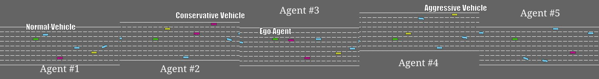
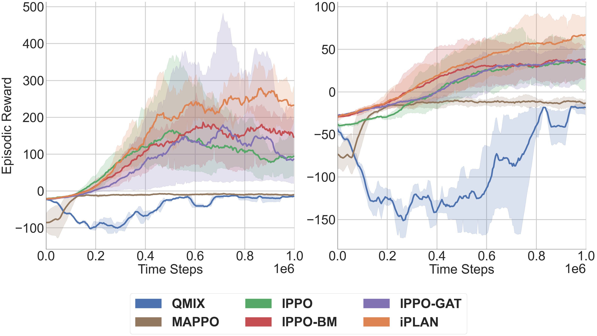
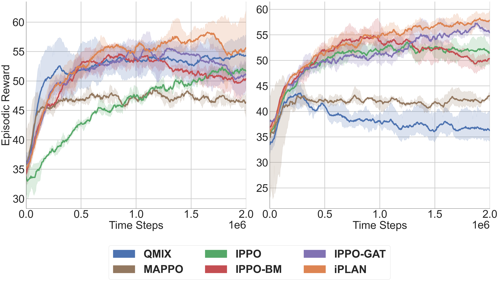
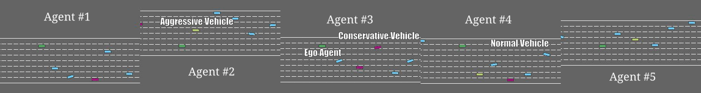
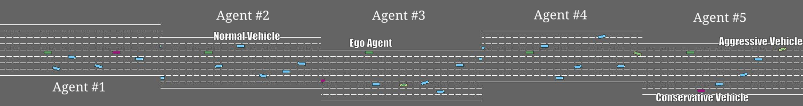
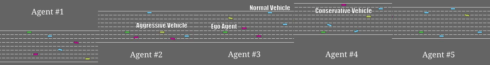
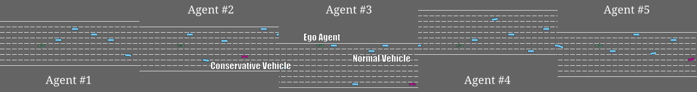
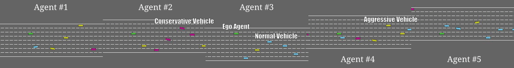

[](https://app.codacy.com/gh/wuxiyang1996/iPLAN/dashboard?utm_source=gh&utm_medium=referral&utm_content=&utm_campaign=Badge_grade)
[](https://pypi.org/project/iPLAN/)


<p align="center">
    <br/>
</p>

This repository is the codebase for our paper.

[**iPLAN: Intent-Aware Planning in Heterogeneous Traffic via Distributed Multi-Agent Reinforcement Learning**](https://arxiv.org/abs/2306.06236)

This repository was originally forked from **https://github.com/oxwhirl/pymarl** 
and **https://github.com/carolinewang01/dm2**. 
The MAPPO baseline comes from **https://github.com/uoe-agents/epymarl**.
The GAT-RNN structure is adapted from the G2ANet implementation made by **https://github.com/starry-sky6688/MARL-Algorithms**.
The idea of the instant incentive inference module is adapted from **https://github.com/usaywook/gin**.

# About
*   Multi-agent Reinforcement Learning
*   Autonoumous Driving
*   Representation Learning

# Table of Contents
-   [**About**](#About)
-   [**Dependencies**](#Dependencies)
-   [**Installation**](#Installation)
-   [**Running iPLAN**](#Running-iPLAN)
-   [**Ablation Study**](#Ablation-Study)
-   [**IPPO**](#Running-IPPO), [**IPPO-BM**](#Running-IPPO-BM), [**IPPO-GAT**](#Running-IPPO-GAT), 
  [**iPLAN-Hard**](#Running-iPLAN-Hard), [**iPLAN-FC**](#Running-iPLAN-FC)
-   [**Baselines**](#Baselines)
-   [**Helper Functions**](#Helper-Functions)
  - [**Compute Navigation Metrics**](#Compute-Navigation-Metrics)
  - [**Generate Animation**](#Generate-Animation)
  - [**Plot Reward Curve**](#Plot-Reward-Curve)
-   [**Results**](#Results)
-   [**Animation**](#Animation)
-   [**Citation**](#Citation)

# Dependencies
*   [**PyTorch**](https://pytorch.org/) (1.13.1 + cu116) (GPU)
*   [**stable-baselines3**](https://github.com/DLR-RM/stable-baselines3)
*   [**Heterogeneous_Highway_Env**](https://github.com/wuxiyang1996/Heterogeneous_Highway_Env) (Forked from
[**highway-env**](https://github.com/Farama-Foundation/HighwayEnv/tree/master))
*   [**scared**](https://sacred.readthedocs.io/en/stable/quickstart.html)
*   [**PyYAML**](https://pypi.org/project/PyYAML/)

**Note**: Please our modified Highway-env given in [**Heterogeneous_Highway_Env**](https://github.com/wuxiyang1996/Heterogeneous_Highway_Env)
as there are major changes from the initial version of [**highway-env**](https://github.com/Farama-Foundation/HighwayEnv/tree/master). Also, 
[**Multi-agent Particles**](https://github.com/openai/multiagent-particle-envs) used in our repo are different. Please use 
the code given in `envs/mpe` folder.
 
# Installation
First, install dependencies
```angular2html
pip install stable-baselines3[extra] pyyaml sacred gym tensorboard_logger
```
Then install our forked version of Highway-env
```angular2html
pip install Heterogeneous_Highway_Env
```
Finally, install iPLAN package
```angular2html
pip install iPLAN
```

# Running iPLAN
In the configuration file `config/default.yaml`, set up environments needed for your experiment:
* Set environment `env`: `MPE` for Non-cooperative Navigation and `highway` for Heterogeneous Highway
* Set difficulty level `difficulty`: 
  * `easy` for easy (Non-cooperative Navigation) or mild (Heterogeneous Highway) scenario.
  * `hard` for hard (Non-cooperative Navigation) or chaotic (Heterogeneous Highway) scenario.
* Set `Behavior_enable: True`
* Set `GAT_enable: True` and `GAT_use_behavior: True`
* Set `soft_update_enable: True` and `behavior_fully_connected: False`
* Run `python3 main.py`

Results, including printed logs, saved models and tensorboard logger, are stored in the folder `results` 

# Ablation Study
When running experiments for ablation study, please only change the hyperparameters mentioned 
in the configuration file `config/default.yaml`
and keep those the same as they are in the iPLAN experiment.
## Running IPPO
*   Set `Behavior_enable: False`
*   Set `GAT_enable: False` and `GAT_use_behavior: False`
*   Run `python3 main.py`

## Running IPPO-BM
*   Set `Behavior_enable: True`
*   Set `GAT_enable: False` and `GAT_use_behavior: False`
*   Run `python3 main.py`

## Running IPPO-GAT
*   Set `Behavior_enable: False`
*   Set `GAT_enable: True` and `GAT_use_behavior: True`
*   Run `python3 main.py`

## Running iPLAN-Hard
*   Set `soft_update_enable: False`
*   Run `python3 main.py`

## Running iPLAN-FC
*   Set `behavior_fully_connected: True`
*   Run `python3 main.py`

# Baselines
Baselines used in this paper could be found in the `baselines`folder, where the organization of files is 
similar to the main directory of iPLAN. Please change the environment setting in `config/default.yaml` 
before experiments. No extra changes need.
*   [**QMIX**](https://github.com/oxwhirl/pymarl): Run `python3 baselines/QMIX/main.py`
*   [**MAPPO**](https://github.com/uoe-agents/epymarl): Run `python3 baselines/MAPPO/main.py`

# Helper Functions
Notebooks for helper function are given in `helper` folder.
Please follow the instructions below:
## Compute Navigation Metrics
(Only for Heterogeneous Highway)
In the configuration file `config/default.yaml`
*   Set `metrics_enable: True`
*   Set `num_test_episodes` larger than `batch_size_run`
*   Run `python3 main.py`

Then you will get printed navigation metrics after the execution logs of each episode.

To compute the navigation metrics, use the notebook `helper/RL_results_metrics.ipynb` to compute averaged navigation 
metrics from the printed log file (usually given in `results/sacred`).

## Generate Animation
(Only for Heterogeneous Highway)
In the configuration file `config/default.yaml`
*   Set `animation_enable: True`
*   (Recommended) Set `metrics_enable: True`, Set `num_test_episodes` larger than `batch_size_run`
*   Run `main.py`

Screenshots of the Heterogeneous Highway are stored in the `animation` folder. Use the notebook 
`helper/Gif_helper.ipynb` to generate animation from screenshots.

## Plot Reward Curve
The printed log file are usually given in `results/sacred`.
*   Choose the log file you want to recover, use the notebook `helper/RL_results_repack.ipynb`
to convert the log file into `.csv` file.
*   Use the notebook `RL Visualization Helper - Highway.ipynb` (Heterogeneous Highway) or 
`RL Visualization Helper - MPE.ipynb` (Non-cooperative Navigation) to plot the reward curve 
from the generated `.csv` files for each approaches and scenarios.

# Results
<p align="center">
    <br/>
    <em> Non-Cooperative Navigation: with 3 agents in the (left) easy and (right) hard scenarios. 50 steps/episode. </em>
</p>
<p align="center">
    <br/>
    <em> Heterogeneous Highway: with 5 agents in (left) mild and (right) chaotic scenarios. 90 steps/episode. </em>
</p>

# Animation
We visually compare the performance of iPLAN
with QMIX and MAPPO. Each baseline is tested with multiple learning agents shown in green, and each animation
shows 5 such learning agents from their respective viewpoints. 
<p align="center">
    <br/>
    <em> iPLAN in mild (easy) scenario of Heterogeneous Highway 
    (Num of agents succeed: 5, Avg. survival time: 90, Avg. speed: 23.95).</em>
</p>

<p align="center">
    <br/>
    <em> iPLAN in chaotic (hard) scenario of Heterogeneous Highway 
    (Num of agents succeed: 5, Avg. survival time: 90, Avg. speed: 21.81).</em>
</p>

<p align="center">
    <br/>
    <em> MAPPO in mild (easy) scenario of Heterogeneous Highway 
    (Num of agents succeed: 2, Avg. survival time: 49.6, Avg. speed: 28.44).</em>
</p>

<p align="center">
    <br/>
    <em> MAPPO in chaotic (hard) scenario of Heterogeneous Highway 
    (Num of agents succeed: 2, Avg. survival time: 54.0, Avg. speed: 28.44).</em>
</p>

<p align="center">
    <br/>
    <em> QMIX in mild (easy) scenario of Heterogeneous Highway 
    (Num of agents succeed: 4, Avg. survival time: 72.6, Avg. speed: 21.2).</em>
</p>

<p align="center">
    <br/>
    <em> QMIX in chaotic (hard) scenario of Heterogeneous Highway 
    (Num of agents succeed: 3, Avg. survival time: 67.8, Avg. speed: 24.9).</em>
</p>

# Acknowledgement

We thank Haoxiang Zhao (@zhx0506) and other community members' effort in maintaining this repo!

# Citation
```
@inproceedings{wu2023intent,
  title={Intent-Aware Planning in Heterogeneous Traffic via Distributed Multi-Agent Reinforcement Learning},
  author={Wu, Xiyang and Chandra, Rohan and Guan, Tianrui and Bedi, Amrit and Manocha, Dinesh},
  booktitle={7th Annual Conference on Robot Learning},
  year={2023}
}
```
